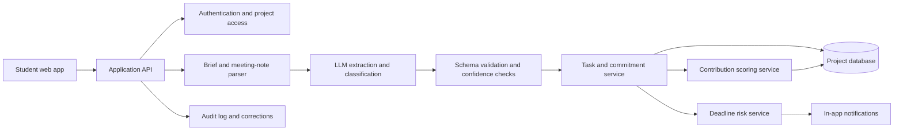

# Taskmates

> An AI-powered group-project coordinator that turns assignment briefs and meeting notes into shared tasks, owners, deadlines, and explainable coordination signals.

**Hackathon result:** Winner, MEMPC Hackathon Prelims 2026

## Product overview

Group projects often create ambiguity around deliverables, ownership, and progress. Students may use chat and task tools, but those tools do not understand an assignment brief, account for task complexity, or help teams identify delivery risk early.

Taskmates helps student teams create a shared execution plan. Users can paste an assignment brief or meeting notes, review AI-generated tasks and commitments, assign owners, monitor progress, and receive deadline-risk warnings.

The product is designed around a core principle:

> AI should reduce coordination friction while keeping users in control of consequential decisions.

## What it does

- Extracts deliverables from assignment briefs
- Suggests task descriptions, effort estimates, owners, and deadlines
- Extracts commitments and action items from meeting notes
- Tracks task status and blockers
- Flags potential deadline risk with an explanation
- Shows contribution signals based on agreed task scope rather than message count or keystrokes

## Links

- **Live prototype:** [Taskmates](https://taskmates.base44.app)
- **Product case study:** [docs/taskmates-case-study.md](docs/taskmates-case-study.md)
- **Demo video:** Coming soon

## Hackathon result

Taskmates won the MEMPC Hackathon Prelims 2026, hosted by Duke MEM Women in Product and Duke University Master of Engineering Management. The prototype was built in one day and judged on AI use, problem clarity, real-world relevance, user interface, and storytelling.

## Product evidence

In an exploratory survey of 500 students, 94% reported contributing more than their perceived fair share on at least one group project. This result should be interpreted as a problem signal rather than a representative population estimate because the sample was not probability-based.

The next validation step is to test Taskmates with real student teams and measure setup time, extraction accuracy, deadline recovery, trust, and perceived fairness.

## Product decisions and tradeoffs

The prototype prioritizes assignment parsing, meeting-note extraction, contribution visibility, and deadline-risk warnings. Every AI-generated task should be reviewed and confirmed by the team before becoming part of the project plan.

Contribution visibility is the most sensitive product decision. A public leaderboard makes imbalance easy to see, but it can also create shame, metric gaming, or pressure to perform visible work. A production version should test a private individual dashboard and team-level summary before using public rankings.

The contribution signal is not a grade, proof of effort, or disciplinary record. It is an explainable coordination aid based on agreed task scope, status, and team-confirmed updates.

## Architecture



For each extracted task, the system should retain the original source sentence, extracted task text, suggested owner, suggested deadline, estimated effort, confidence score, and user-confirmation status. User-confirmed task state remains the source of truth.

## Responsible AI and privacy

- Users review AI-generated tasks before confirmation.
- The product does not use keystrokes or private-message surveillance as contribution proxies.
- Users should be able to correct, dispute, export, and delete project data.
- Individual scores should not be visible to instructors by default.
- Contribution signals should never be used automatically for grades or discipline.
- The product should show source evidence and uncertainty for AI outputs.
- Assignment briefs and meeting notes may contain sensitive academic or personal information and should be minimized and protected.

## Metrics and experiments

### North Star metric

**Percentage of teams that complete all critical deliverables on time and report that work allocation was fair.**

### Supporting metrics

- Brief-parsing accuracy
- Action-item precision
- Time from brief upload to confirmed plan
- AI-field edit rate
- Deadline-risk precision
- Critical deliverable on-time completion
- Reported fairness
- Trust in AI outputs
- Recovery rate for at-risk tasks

### Planned experiments

1. **AI planning:** Compare manual task creation with AI-generated drafts. Measure setup time, task completeness, correction rate, and trust.
2. **Contribution visibility:** Compare a public leaderboard, private individual dashboard, and team-level workload summary. Measure fairness, conflict, willingness to reuse, and opt-out rate.
3. **Deadline warnings:** Compare explainable warnings with generic reminders. Measure recovery rate, false positives, and notification dismissal.

## Limitations

- AI extraction can miss or misinterpret requirements.
- Contribution signals cannot capture every form of work, including offline coordination and emotional labor.
- Deadline prediction requires real usage data for calibration.
- The prototype has limited user testing.
- The leaderboard concept requires additional privacy and fairness research.

## Roadmap

1. Add source-span highlighting for extracted tasks.
2. Add correction and dispute workflows.
3. Test private contribution views against public rankings.
4. Evaluate extraction accuracy with labeled assignment briefs.
5. Test deadline-risk warnings with real student teams.
6. Add accessible, team-controlled data-sharing settings.

## Repository structure

```text
docs/
  taskmates-case-study.md
README.md
```

## About the project

Taskmates was created to explore how AI can make teamwork more visible without turning collaboration into surveillance. The project focuses on product discovery, responsible AI, user-centered design, measurable outcomes, and clear communication.

## Author

[Nishita Harsh](https://www.linkedin.com/in/nishitaharsh/)

## License

Add a license before open-sourcing or redistributing the code. The current repository primarily contains product documentation and portfolio materials.
