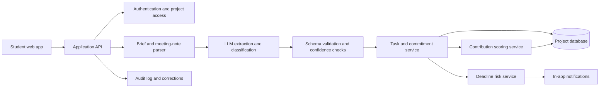

# Taskmates: Product Case Study and Portfolio Playbook

## Goal

Turn Taskmates from a hackathon prototype into a credible Google APM portfolio project that demonstrates problem discovery, user research, product judgment, technical fluency, responsible AI thinking, experimentation, communication, and execution.

The finished portfolio should contain:

1. A two- to four-page product case study.
2. A concise product requirements document.
3. A system architecture diagram and technical explanation.
4. A contribution-scoring and fairness explanation.
5. A metrics and experiment plan.
6. Documented user feedback and iteration decisions.
7. A two- to three-minute demo video.
8. A polished GitHub README with a working link, screenshots, setup instructions, and limitations.

Do not present the project as fully validated if it has only been tested in a hackathon. Clearly separate **what you built**, **what users told you**, and **what still needs validation**.

---

## 1. Case-study structure

Use this order because it leads with the outcome and then explains the reasoning.

### Title

**Taskmates: Making group-project work visible and easier to coordinate**

Subtitle:

> An AI-powered group-project coordinator that converts assignment briefs and meeting notes into structured tasks, ownership, deadlines, and contribution insights.

Add a small metadata line:

> Winner, MEMPC Hackathon Prelims 2026 | Role: [your role] | Built in: one day | Prototype: [live link]

### Executive summary

Write three short paragraphs:

1. The user problem.
2. The product and your contribution.
3. The result and the most important lesson.

Example:

> Group projects often fail because teams lack a shared understanding of deliverables, ownership, and progress. Students may use chat and task tools, but those tools do not interpret an assignment brief or make workload imbalance visible.
>
> I built Taskmates, an AI-powered coordinator that extracts deliverables from assignment briefs and meeting notes, estimates effort, suggests owners, tracks progress, and flags deadline risk. I owned the problem framing, feature prioritization, product flow, AI use cases, contribution model, and hackathon presentation.
>
> Taskmates won the MEMPC Hackathon Prelims 2026. The project taught me that the strongest use of AI was not replacing teamwork; it was reducing coordination friction and exposing work that was otherwise invisible.

### Outcome and evidence

Show the strongest evidence near the top:

- Hackathon result: winner.
- Build time: one day.
- Survey: exploratory survey of 500 students, with exact question wording and sampling caveats.
- Prototype link.
- Number of users who tested the prototype.
- Number of usability sessions completed.
- Any measurable reduction in task-setup time or missed action items.

If a number has not been measured, label it **planned** instead of inventing it.

---

## 2. Clear problem statement

Use a problem statement that identifies the user, context, pain, and consequence.

### Recommended version

> University students working in teams struggle to translate ambiguous assignment briefs and meeting discussions into clear ownership, balanced workloads, and timely execution. Existing chat and task tools record activity, but they do not understand academic deliverables, estimate task complexity, or help teams detect contribution imbalance early. This creates coordination overhead, missed deadlines, conflict, and a perception that some teammates are carrying more than their share.

### Problem hypothesis

> If Taskmates converts assignment requirements and meeting commitments into structured, weighted tasks, then teams will spend less time coordinating, identify risk earlier, and report a stronger sense of workload fairness.

### Non-goals

State what Taskmates does not attempt to do:

- It does not determine a student’s grade.
- It does not make final peer-evaluation decisions.
- It does not prove that a student did or did not contribute.
- It does not replace a professor’s rubric.
- It does not monitor private messages or activity without consent.
- It does not guarantee that an AI-extracted task list is correct.

These boundaries make the product more credible and responsible.

---

## 3. Survey methodology

The survey section should make the 94% result trustworthy rather than promotional.

### Document these items

| Item | What to record |
|---|---|
| Objective | What you wanted to learn about group-project coordination and workload imbalance |
| Population | Who qualified to respond, such as current or recent university students |
| Sample size | 500 respondents, if this is the final verified number |
| Recruitment | Where respondents came from and whether participation was voluntary |
| Dates | When the survey ran |
| Exact question | The precise wording behind the 94% result |
| Response options | The available choices and whether respondents could select multiple answers |
| Analysis | How you calculated the percentage |
| Limitations | Self-selection, recall bias, school mix, geographic concentration, and wording effects |

### Safer wording

Use this unless the sample was probability-based:

> In an exploratory survey of 500 students, 94% reported contributing more than their perceived fair share on at least one group project. Because respondents were recruited through [channel], this result indicates a strong problem signal but should not be treated as representative of all university students.

### Follow-up research

Conduct five to ten semi-structured interviews. Ask:

1. Tell me about the last group project you completed.
2. How did your team decide what work needed to be done?
3. How did you assign ownership?
4. What happened when someone missed a commitment?
5. How did you know whether work was balanced?
6. Which tools did you use?
7. What did those tools fail to capture?
8. Would a contribution dashboard help or create new problems?
9. Who should be allowed to see contribution information?
10. What would make you distrust an AI-generated task list?

Summarize findings by theme. Do not include names or identifiable student details without permission.

---

## 4. User personas

Use personas as decision tools, not fictional biographies. Base each one on interview evidence and label assumptions.

### Persona A: The overloaded coordinator

**Context:** Frequently becomes the default organizer because they care about quality and deadlines.

**Needs:** A fast way to convert the assignment into tasks, assign ownership, and identify risk without repeatedly chasing teammates.

**Pain points:** Invisible coordination work, late responses, and responsibility for fixing incomplete work.

**Success:** The team leaves its first meeting with clear owners, effort estimates, and deadlines.

### Persona B: The reliable specialist

**Context:** Completes difficult technical or analytical work but may not communicate progress frequently.

**Needs:** A fair representation of complex work that is not reduced to the number of checklist items completed.

**Pain points:** Activity-based metrics undervalue deep work and create pressure to perform visible work.

**Success:** Contribution is represented by agreed task scope, complexity, quality, and completion—not message volume.

### Persona C: The disengaged or overloaded teammate

**Context:** Misses commitments because of competing coursework, work, health, or unclear expectations.

**Needs:** Earlier warnings, manageable task breakdowns, and a safe way to renegotiate ownership.

**Pain points:** Public shaming, unclear deadlines, and discovering too late that a task is larger than expected.

**Success:** The system surfaces risk early and supports help-seeking rather than punishment.

### Persona D: The instructor or program administrator

**Context:** Wants better team outcomes but should not automatically receive surveillance data.

**Needs:** Aggregate signals about recurring coordination problems and optional team-level summaries.

**Pain points:** Privacy, false accusations, and students optimizing for a metric.

**Success:** Receives useful aggregate insight without accessing unnecessary individual activity data.

---

## 5. User journey

Create a visual journey in the case study. Start with the team’s first interaction and show the emotional state and product opportunity at each step.

| Stage | User action | Friction | Taskmates opportunity | Evidence to collect |
|---|---|---|---|---|
| Discover | Team receives assignment | Requirements are ambiguous | Explain the assignment and identify deliverables | Interview quotes |
| Set up | Team pastes the brief | Long coordination meeting | Generate draft tasks, estimates, and owners | Setup time |
| Align | Team reviews the draft | Suggested owners may be wrong | Let users edit, confirm, and negotiate assignments | Edit rate |
| Execute | Members work on tasks | Progress is invisible | Show status and agreed contribution signals | Completion data |
| Coordinate | Meeting produces commitments | Action items get lost in chat | Extract commitments and deadlines from notes | Extraction accuracy |
| Detect risk | A task starts slipping | Team learns too late | Flag deadline risk with explanation | Precision and recall |
| Reflect | Team evaluates collaboration | Fairness is subjective | Show evidence with uncertainty and user controls | Fairness survey |

The most important design principle is that AI should generate **drafts for team confirmation**, not silently make consequential decisions.

---

## 6. Product requirements document

### Product objective

Help student teams create a shared, accurate, and fair execution plan from assignment requirements and meeting commitments.

### MVP users

University students working on graded team assignments, particularly teams of three to six people.

### MVP user stories

| Priority | User story | Acceptance criteria |
|---|---|---|
| P0 | As a student, I can paste an assignment brief and receive a draft task list. | Tasks include deliverable, description, estimated effort, deadline if available, and source text. |
| P0 | As a team member, I can edit and confirm generated tasks. | Every AI-generated task can be edited, deleted, split, or accepted. |
| P0 | As a team, we can assign owners and due dates. | Assignments require explicit user confirmation. |
| P0 | As a student, I can paste meeting notes and extract commitments. | The system identifies action, owner, deadline, confidence, and source sentence. |
| P0 | As a team, we can see task status. | Status supports not started, in progress, blocked, and complete. |
| P1 | As a team, we can see contribution signals weighted by agreed task scope. | The score shows inputs, uncertainty, and cannot be treated as a grade. |
| P1 | As a team, we can receive deadline-risk warnings. | Each warning explains the trigger and offers a recovery action. |
| P1 | As a user, I can correct an AI error. | Corrections are saved and visible to the team. |
| P2 | As an instructor, I can view aggregate team health. | Individual surveillance is off by default. |

### Functional requirements

- Brief ingestion accepts pasted text and, if supported, a document upload.
- Extraction returns structured JSON with source spans.
- Users can confirm or edit all generated tasks.
- Task assignments are visible to the team members who have access.
- Deadline warnings include an explanation and recommended next step.
- Contribution views show the calculation inputs and confidence limitations.
- Teams can delete a project and export their data.

### Non-functional requirements

- Clear consent before sharing contribution data.
- Access control at the project and team level.
- Protection against prompt injection in pasted assignment text.
- Safe handling of student data and meeting notes.
- Graceful failure when the AI cannot parse a brief.
- Accessible color, keyboard, and mobile interaction patterns.

### Explicit product tradeoff

The hackathon version used a visible leaderboard because it made the accountability problem easy to understand. For a real product, test a private individual dashboard and a team-level summary first. Public rankings may create competition, shame, metric gaming, or harm to students whose work is less visible.

---

## 7. System architecture

Use a simple architecture diagram. Do not make the design look more complex than the prototype.



### Explain each component

**Web app:** Captures briefs, meeting notes, task edits, confirmations, and progress updates.

**Application API:** Enforces project access, validates requests, and coordinates services.

**Parser:** Sends only the necessary text to the model and requests structured outputs.

**LLM layer:** Extracts deliverables, action items, deadlines, owners, and suggested effort. It should not make final assignments without confirmation.

**Schema validation:** Rejects malformed output, records confidence, and requires user review for low-confidence fields.

**Task service:** Stores the canonical user-confirmed task state.

**Contribution service:** Calculates explainable signals from agreed scope and status events.

**Risk service:** Uses deadline, remaining effort, blockers, and completion rate to estimate risk.

**Audit log:** Records AI suggestions, user corrections, and important changes so users can understand how a result was produced.

### Technical explanation to include in the README

For every extracted task, store:

- Original source sentence
- Extracted task text
- Suggested owner
- Suggested deadline
- Estimated effort
- Confidence score
- User confirmation status
- Last editor and timestamp

This makes the system more explainable and supports debugging.

---

## 8. Contribution-scoring explanation

Do not call the score a measure of a person’s true contribution. Call it a **coordination signal**.

### Example model

For each task `t`, define an agreed task weight:

```text
Task weight = estimated effort × complexity multiplier
```

For a member `m`:

```text
Contribution signal(m) =
  sum of confirmed completed task weights
  ÷ sum of all confirmed task weights assigned to the team
```

Add modifiers only if you can justify them:

- Completion quality: based on team confirmation, not hidden surveillance.
- Timeliness: a small factor, because late work may still be high-value work.
- Rework: record it as a product signal, not automatic blame.
- Untracked work: allow team members to add and confirm work performed outside the tool.

### Example

A five-minute task-count model might treat ten formatting tasks as more valuable than one difficult data-analysis task. A weighted model can instead assign:

| Task | Estimated effort | Complexity | Weight |
|---|---:|---:|---:|
| Collect sources | 2 hours | 1.0 | 2.0 |
| Build analysis | 5 hours | 1.8 | 9.0 |
| Create slides | 3 hours | 1.2 | 3.6 |

The case study should show that the model is only an approximation. It should also explain that task weight is agreed by the team and can be corrected.

### Fairness safeguards

- Do not use the score to assign grades automatically.
- Show the inputs behind every score.
- Let users contest, edit, or annotate a task.
- Include work completed outside the app.
- Avoid using message count, keystrokes, or presence as proxies for contribution.
- Make visibility opt-in or team-controlled.
- Show a confidence range or “insufficient evidence” state.
- Test whether the metric systematically disadvantages certain working styles.

---

## 9. Metrics and experiment plan

### North Star metric

> Percentage of teams that complete all critical deliverables on time and report that work allocation was fair.

This combines execution and user value. Do not rely on engagement alone.

### Input and outcome metrics

| Metric | Definition | Why it matters |
|---|---|---|
| Brief parsing accuracy | Correct deliverables extracted ÷ deliverables identified by a human reviewer | Measures AI usefulness |
| Action-item precision | Correct extracted commitments ÷ all extracted commitments | Prevents noisy meeting summaries |
| Setup time | Minutes from first brief upload to confirmed plan | Measures coordination reduction |
| Confirmation edit rate | AI fields edited ÷ AI fields generated | Shows where automation fails |
| Deadline-risk precision | True late tasks flagged ÷ all tasks flagged | Controls warning fatigue |
| On-time completion | Critical deliverables completed by deadline ÷ critical deliverables | Measures execution |
| Fairness perception | Post-project survey score | Measures whether the product feels useful and fair |
| Trust score | User rating of confidence in AI outputs | Measures adoption barrier |
| Recovery rate | At-risk tasks that return to on-track status | Measures whether warnings help |

### Experiment 1: AI task planning

**Question:** Does AI-assisted task generation reduce setup time without reducing plan quality?

**Control:** Teams create tasks manually from the brief.

**Treatment:** Teams review an AI-generated draft.

**Primary metric:** Time to confirmed plan.

**Guardrails:** Human-rated task completeness, number of serious corrections, and user trust.

### Experiment 2: Contribution visibility

**Question:** Which view improves fairness without increasing conflict?

**A:** Public individual leaderboard.

**B:** Private individual dashboard plus team-level summary.

**C:** Team-only workload balance view.

**Primary metric:** Reported fairness and willingness to use the product again.

**Guardrails:** Conflict reports, score disputes, perceived surveillance, and opt-out rate.

### Experiment 3: Deadline warnings

**Question:** Do explainable warnings help teams recover earlier?

**Treatment:** Warning includes the trigger, affected task, and suggested recovery action.

**Control:** Generic reminder only.

**Primary metric:** Percentage of at-risk tasks returned to on-track status.

**Guardrails:** False-positive rate and notification dismissal rate.

### Minimum validation plan

Test with at least five teams. Give each team the same short assignment brief and observe:

- How long setup takes.
- Which AI suggestions are accepted or edited.
- Whether task owners understand the assignment.
- Whether the contribution view causes confusion.
- Whether deadline warnings lead to an action.

Record short quotes, but anonymize them. A small usability study is valuable if the method and limitations are transparent.

---

## 10. Privacy and fairness analysis

### Main risks

**Surveillance:** Students may feel monitored if every action becomes a performance signal.

**False accusations:** An inaccurate score may imply that someone did not contribute.

**Invisible work:** Mentoring, coordination, emotional labor, and offline work may be missed.

**Bias:** The model may favor communication styles, time zones, or work patterns that are easier to observe.

**Sensitive data:** Assignment briefs and meeting notes may contain personal information or academic records.

**Function creep:** A tool introduced for coordination could later be used for grading or discipline.

**Security:** Shared project data may be exposed to unauthorized teammates or third parties.

### Product safeguards

- Collect only the text and events needed for the selected feature.
- Tell users what is stored and who can see it.
- Require confirmation before sharing a contribution summary.
- Keep individual scores out of instructor views by default.
- Provide deletion and export controls.
- Retain source text only as long as necessary.
- Display uncertainty and source evidence for AI-generated outputs.
- Let users correct or dispute records.
- Never make academic or disciplinary decisions automatically.
- Evaluate outcomes across different working styles and accessibility needs.

### Questions to ask users

- Would you use this if your instructor could see it?
- Which information should remain private?
- What would make a contribution score feel unfair?
- How should offline work be added?
- Should the team see individual scores, team-level balance, or only task status?

Document what users said and which product decisions changed as a result.

---

## 11. User feedback and iteration log

Create a table like this and fill it with real observations.

| Date | Participant/team | Observation or quote | Severity | Decision | Status |
|---|---|---|---|---|---|
| [date] | Team A | “The AI missed the presentation rubric.” | High | Add source text and allow manual task creation. | Done |
| [date] | Team B | “I would not want a public ranking.” | High | Test private dashboard first. | Planned |
| [date] | Team C | “The warning did not explain what to do next.” | Medium | Add a recovery action to warnings. | Done |

A strong case study includes at least three iterations. For each one, explain the original assumption, what evidence challenged it, and what changed.

---

## 12. Short demo video

Aim for **two minutes and thirty seconds**. Record the product first and add voice-over afterward if that produces a cleaner result.

### Suggested script

**0:00–0:15 — Hook**

> Group projects do not usually fail because students cannot make a checklist. They fail because assignment requirements, ownership, and progress remain unclear until it is too late.

**0:15–0:35 — Problem evidence**

> In an exploratory survey of 500 students, 94% reported doing more than their perceived fair share on at least one group project. Existing tools track activity, but they do not understand the assignment or represent task complexity.

**0:35–1:20 — Product walkthrough**

Show the following sequence:

1. Paste an assignment brief.
2. Show extracted deliverables.
3. Edit or confirm a task.
4. Assign an owner and deadline.
5. Paste meeting notes.
6. Show extracted commitments.
7. Open the progress view.
8. Trigger a deadline-risk warning.

Voice-over:

> Taskmates turns the assignment into a draft execution plan. The team reviews every AI suggestion before it becomes part of the project. Meeting notes become commitments, and risk alerts explain which task is slipping and what the team can do next.

**1:20–1:45 — Product judgment**

> The hardest design decision was contribution visibility. A public leaderboard makes imbalance visible, but it can also create shame and encourage metric gaming. For a real launch, I would test a private dashboard and team-level summary before using public rankings.

**1:45–2:05 — Technical explanation**

> The system extracts structured tasks with source text, confidence, effort, and deadlines. A validation layer checks the output, while user confirmation remains the source of truth. Contribution signals use agreed task scope rather than message count or keystrokes.

**2:05–2:25 — Result and next step**

> I built Taskmates in one day and won the MEMPC Hackathon Prelims 2026. My next step would be testing it with real teams to measure setup time, extraction accuracy, deadline recovery, and perceived fairness.

**2:25–2:30 — Close**

> Taskmates is not trying to replace teamwork. It is trying to make teamwork easier to see and coordinate.

### Recording checklist

- Use a clean browser profile.
- Remove personal data from examples.
- Use a realistic but fictional assignment brief.
- Zoom the browser to make text readable.
- Record at 1080p if possible.
- Keep cursor movement slow.
- Add captions.
- Put the prototype link and GitHub link in the video description.
- Avoid claiming that the product is production-ready.

---

## 13. Polished GitHub README

Use this structure in `README.md`.

```markdown
# Taskmates

> An AI-powered group-project coordinator that turns assignment briefs and meeting notes into shared tasks, owners, deadlines, and explainable coordination signals.

[Live demo](YOUR_URL) · [Demo video](YOUR_URL) · [Case study](YOUR_URL)

## Why Taskmates

Group projects often create ambiguity around deliverables, ownership, and progress. Taskmates helps teams create a shared execution plan while keeping users in control of AI-generated suggestions.

## What it does

- Extracts deliverables from an assignment brief
- Suggests effort estimates and task owners
- Extracts commitments from meeting notes
- Tracks task status and blockers
- Flags deadline risk with an explanation
- Shows contribution signals based on agreed task scope

## Product demo

Add a short GIF or three screenshots here.

## Hackathon result

Winner, MEMPC Hackathon Prelims 2026, hosted by Duke MEM Women in Product and Duke University Master of Engineering Management.

## Product evidence

In an exploratory survey of 500 students, 94% reported contributing more than their perceived fair share on at least one group project. The sample was [describe recruitment method], so this result is a problem signal rather than a representative population estimate.

## Product decisions

The prototype prioritizes assignment parsing, meeting-note extraction, contribution visibility, and deadline-risk warnings. Every AI-generated task must be reviewed by the team. The contribution view is a coordination signal, not a grade or proof of individual effort.

## Architecture

Add the architecture diagram and explain the parser, structured output validation, task service, scoring logic, and risk service.

## Responsible AI and privacy

- User confirmation is required before AI suggestions become team tasks.
- The system does not use keystrokes or private-message surveillance as contribution proxies.
- Users can correct or delete project data.
- Scores should not be used automatically for grading or discipline.
- The prototype has not been validated for all working styles or accessibility needs.

## Local development

### Prerequisites

- Node.js [version]
- [Database, if applicable]
- [API key or environment variable, if applicable]

### Installation

```bash
git clone YOUR_REPOSITORY_URL
cd taskmates
npm install
cp .env.example .env
npm run dev
```

### Environment variables

Document variable names without committing secrets:

```text
LLM_API_KEY=
DATABASE_URL=
NEXT_PUBLIC_APP_URL=
```

## Repository structure

```text
src/
  components/       UI components
  features/         Product features
  lib/              API clients and utilities
  services/         Parsing, scoring, and risk logic
  types/            Shared types
public/              Screenshots and static assets
docs/                Case study and architecture notes
```

## Limitations

- AI extraction can miss or misinterpret requirements.
- Contribution signals cannot capture every form of work.
- The deadline predictor requires real usage data for calibration.
- The prototype has limited user testing.
- The public leaderboard concept requires additional fairness research.

## Roadmap

1. Add source-span highlighting for extracted tasks.
2. Test private contribution views against public rankings.
3. Add correction and dispute workflows.
4. Evaluate extraction accuracy with labeled briefs.
5. Test deadline-risk warnings with real student teams.

## Author

[Your name] · [LinkedIn] · [Email]
```

### README quality checklist

- The first screen explains the problem and shows the live demo.
- Screenshots are clean and use fictional data.
- Setup instructions work from a fresh clone.
- Environment variables are documented but secrets are not committed.
- The README distinguishes prototype capabilities from planned features.
- The repository contains a license if you want others to use the code.
- The project has a clear commit history or release tag.
- Broken links and screenshots are checked before sharing.

---

## 14. Four-week execution plan

### Week 1: Evidence and framing

- Verify the survey question, sample, and calculation.
- Conduct five to ten user interviews.
- Create personas and the current-state journey.
- Identify the riskiest assumption: whether contribution visibility helps more than it harms.

### Week 2: Product and technical documentation

- Write the PRD.
- Document the architecture.
- Define the contribution model.
- Add source spans, confidence, and correction states if the prototype supports them.
- Create a privacy and fairness page.

### Week 3: Validation and iteration

- Test the prototype with at least five teams or individual users.
- Measure setup time, extraction errors, and trust.
- Compare at least two contribution-display designs.
- Create an iteration log with three evidence-based changes.

### Week 4: Portfolio packaging

- Write the final case study.
- Polish the GitHub README.
- Record and caption the demo video.
- Test the live link on a clean browser.
- Add the project to your resume and LinkedIn.
- Prepare a five-minute interview presentation.

---

## 15. Final portfolio claims

Use claims that are accurate and defensible.

### Strong claims

- “Won the MEMPC Hackathon Prelims 2026.”
- “Built and launched a working AI-powered prototype in one day.”
- “Designed a workflow that converts assignment briefs and meeting notes into reviewable tasks.”
- “Developed an explainable contribution model based on agreed task scope rather than activity count.”
- “Identified privacy and fairness risks in public contribution rankings and proposed alternative experiments.”

### Claims to avoid unless you have evidence

- “Eliminates free-riding.”
- “Proves who did the work.”
- “Accurately predicts deadline failure.”
- “No other tool solves this problem.”
- “Used by 500 students,” unless 500 students actually used the product rather than only answering the survey.
- “Production-ready,” unless the system has appropriate security, reliability, privacy, and operational testing.

## Definition of done

Taskmates is portfolio-ready when a reviewer can understand the user problem in thirty seconds, see the product working in two minutes, inspect the technical approach in five minutes, identify the product tradeoffs, and verify that your claims are supported by evidence.
