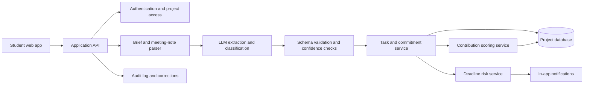

# Taskmates: Making Group-Project Work Visible

> An AI-powered group-project coordinator that turns assignment briefs and meeting notes into shared tasks, owners, deadlines, and explainable coordination signals.

**Hackathon result:** Winner, MEMPC Hackathon Prelims 2026  
**Hosted by:** Duke MEM Women in Product and Duke University Master of Engineering Management  
**Build time:** One day  
**Prototype:** [taskmates.base44.app](https://taskmates.base44.app)

## Executive summary

University group projects often fail quietly. The assignment may be clear to the professor, but the student team still has to translate it into deliverables, divide the work, coordinate deadlines, and determine whether the workload is balanced. Existing chat and task tools record activity, but they do not understand an assignment brief or help a team reason about task complexity.

Taskmates addresses this coordination gap. A student can paste an assignment brief and receive a draft task list with suggested owners, effort estimates, and deadlines. Meeting notes can be converted into commitments and action items. The product also provides progress visibility and deadline-risk warnings.

The central product insight is that AI is most useful here not as a replacement for teamwork, but as a way to reduce coordination friction and make invisible work easier to discuss.

## The problem

Students frequently experience an imbalance between assigned work and perceived contribution. One teammate may spend hours coordinating, revising, and following up while another appears to complete a larger number of smaller tasks. When teams discover the imbalance near the deadline, there is little time to recover.

The problem is not simply a lack of checklists. It has three connected parts:

1. **Requirements are ambiguous.** Assignment briefs contain multiple deliverables, dependencies, and quality expectations.
2. **Ownership is unclear.** Teams often leave meetings without explicit owners, effort estimates, or confirmation that the workload is balanced.
3. **Progress is invisible.** Chat messages and task counts do not reliably represent deep work, coordination, revisions, or blocked tasks.

### Problem statement

> University students working in teams struggle to translate ambiguous assignment briefs and meeting discussions into clear ownership, balanced workloads, and timely execution. Existing tools do not understand academic deliverables, estimate task complexity, or help teams detect contribution imbalance early.

### Product hypothesis

> If Taskmates converts assignment requirements and meeting commitments into structured, weighted tasks, then teams will spend less time coordinating, identify risk earlier, and report a stronger sense of workload fairness.

## User research

An exploratory survey of 500 students found that **94% reported doing more than their perceived fair share on at least one group project**. This result is treated as a strong problem signal, not as a representative population estimate, because the sample was not probability-based.

Before presenting this statistic publicly, the research record should document the exact question wording, recruitment channels, response options, collection dates, calculation method, and sample limitations. The preferred wording is:

> In an exploratory survey of 500 students, 94% reported contributing more than their perceived fair share on at least one group project.

The next research phase is a set of five to ten semi-structured interviews with students who recently completed team assignments. The interviews should examine how teams interpret briefs, assign work, handle missed commitments, and decide whether contribution was fair. They should also test whether a contribution dashboard feels useful or invasive.

## Users and personas

### The overloaded coordinator

This student becomes the default organizer because they care about quality and deadlines. They need a quick way to convert the assignment into tasks, assign ownership, and identify risk without repeatedly chasing teammates.

**Success:** The team leaves its first meeting with clear owners, effort estimates, and deadlines.

### The reliable specialist

This student completes difficult technical or analytical work that may not produce many visible checklist items. They need a fair representation of complex work that is not reduced to message volume or task count.

**Success:** Contribution reflects agreed scope, complexity, quality, and completion rather than visibility alone.

### The overloaded or disengaged teammate

This student misses a commitment because of competing coursework, work, health, or unclear expectations. They need earlier warnings, smaller task breakdowns, and a safe way to renegotiate ownership.

**Success:** The product surfaces risk early and supports recovery instead of public punishment.

## User journey

| Stage | User action | Friction | Taskmates opportunity |
|---|---|---|---|
| Discover | Team receives an assignment | Requirements are ambiguous | Explain the brief and identify deliverables |
| Set up | Team pastes the brief | Coordination consumes time | Generate a draft plan with tasks and estimates |
| Align | Team reviews the draft | Suggested owners may be wrong | Let users edit, confirm, split, or reassign tasks |
| Execute | Members work | Progress is invisible | Show status, blockers, and agreed scope |
| Coordinate | Team meets | Action items disappear in chat | Extract commitments and deadlines from notes |
| Detect risk | A task begins slipping | Team discovers the problem late | Flag risk with an explanation and recovery action |
| Reflect | Team evaluates collaboration | Fairness is subjective | Show evidence with uncertainty and user controls |

## Product solution

### Assignment-to-task planning

The user pastes an assignment brief. Taskmates identifies deliverables, dependencies, suggested effort, potential deadlines, and possible owners. The result is a draft, not an automatic decision. Team members can edit, delete, split, or confirm every generated task.

### Meeting-note extraction

The user pastes meeting notes. Taskmates extracts commitments, action items, owners, deadlines, and the source sentence that supports each item. This reduces the chance that an agreement disappears into a group chat.

### Progress visibility

The team sees task status, blockers, and ownership in one shared view. The product focuses on work that the team has agreed to track rather than hidden monitoring of messages, keystrokes, or presence.

### Deadline-risk warnings

The product flags a task when the remaining effort, current progress, blockers, and deadline suggest elevated risk. A useful warning should explain why the task is at risk and recommend a recovery action, such as reducing scope, adding support, or renegotiating ownership.

## Product requirements

### MVP requirements

- Users can paste an assignment brief.
- The system returns a structured draft task list.
- Users can edit, delete, split, and confirm generated tasks.
- Teams can assign owners and due dates.
- Users can paste meeting notes and extract commitments.
- Teams can track not started, in progress, blocked, and complete states.
- The product can show a deadline-risk warning with an explanation.
- The product exposes the inputs behind contribution signals.

### Non-goals

Taskmates does not determine grades, prove that a student did or did not contribute, replace a professor’s rubric, or make disciplinary decisions. It does not automatically monitor private messages or silently assign consequential work.

## System architecture



Each extracted task should retain its original source sentence, extracted task text, suggested owner, suggested deadline, estimated effort, confidence score, and confirmation status. User-confirmed state remains the source of truth.

## Contribution-scoring model

Taskmates should describe its output as a **contribution signal**, not a measure of a person’s true contribution. The score is an aid for team coordination and reflection.

A basic explainable model is:

```text
Task weight = estimated effort × complexity multiplier

Contribution signal(member) =
  confirmed completed task weight assigned to member
  ÷ confirmed task weight assigned to the team
```

For example, a five-hour data-analysis task may deserve more weight than ten small formatting tasks. Task weight should be agreed by the team and remain editable.

The model should not use message count, keystrokes, or presence as a proxy for effort. It should allow members to add work completed outside the tool, annotate disagreements, and identify insufficient evidence. A score should never be used automatically for grading or discipline.

## Privacy and fairness

The most important product risk is that visibility can become surveillance. A public leaderboard could make imbalance visible, but it could also create shame, metric gaming, or pressure to perform work that is easy to observe.

The safer product direction is to test a private individual dashboard and a team-level workload summary before using public rankings. Additional safeguards include:

- User confirmation before AI suggestions become shared tasks.
- Clear explanation of what data is stored and who can see it.
- Correction, dispute, export, and deletion controls.
- Individual scores hidden from instructors by default.
- Source evidence and uncertainty displayed for AI-generated outputs.
- No automatic use of signals for grades or disciplinary decisions.
- Minimal collection of assignment and meeting-note content.
- Evaluation across different working styles, time zones, and accessibility needs.

## Metrics and experiment plan

### North Star metric

> Percentage of teams that complete all critical deliverables on time and report that work allocation was fair.

### Supporting metrics

| Metric | Definition |
|---|---|
| Brief-parsing accuracy | Correct deliverables extracted divided by deliverables identified by a human reviewer |
| Action-item precision | Correct extracted commitments divided by all extracted commitments |
| Setup time | Minutes from brief upload to confirmed plan |
| AI edit rate | AI-generated fields edited by users divided by total generated fields |
| Deadline-risk precision | Late tasks correctly flagged divided by all tasks flagged |
| On-time completion | Critical deliverables completed by deadline divided by critical deliverables |
| Fairness perception | Post-project user rating of workload fairness |
| Trust score | User rating of confidence in AI outputs |
| Recovery rate | At-risk tasks returned to on-track status after a warning |

### Experiments

**Experiment 1: AI task planning.** Compare manual task creation with reviewable AI-generated drafts. Measure setup time, task completeness, correction rate, and trust.

**Experiment 2: Contribution visibility.** Compare a public leaderboard, private individual dashboard, and team-level workload summary. Measure perceived fairness, conflict, willingness to reuse, and opt-out rate.

**Experiment 3: Deadline warnings.** Compare explainable warnings with generic reminders. Measure recovery rate, false positives, and notification dismissal.

## Hackathon result and lessons

Taskmates was built in one day and won the MEMPC Hackathon Prelims 2026. The project was judged on AI use, problem clarity, real-world relevance, interface quality, and storytelling.

The most important lesson was that a strong product idea begins with a problem people actually live. Students are not necessarily unwilling to contribute; teams often lack accountability infrastructure and a shared understanding of work. The project also reinforced that a compelling AI product does not need to replace human judgment. It can create useful structure and visibility while leaving important decisions with users.

## What I would build next

1. Add source-span highlighting so users can trace every extracted task to the original brief or meeting note.
2. Test private contribution views against public rankings.
3. Add dispute and correction workflows.
4. Label assignment briefs and measure extraction accuracy.
5. Test deadline-risk warnings with real student teams.
6. Add accessibility and team-controlled data-sharing settings.

## Limitations

The current prototype has limited user testing. The survey result is exploratory and may not generalize to all students. AI extraction can miss or misinterpret requirements. Contribution signals cannot capture every form of work, particularly offline coordination, emotional labor, and work performed outside the tool. The deadline predictor requires real usage data for calibration.

## Links

- [Live prototype](https://taskmates.base44.app)
- [Project README](../README.md)
